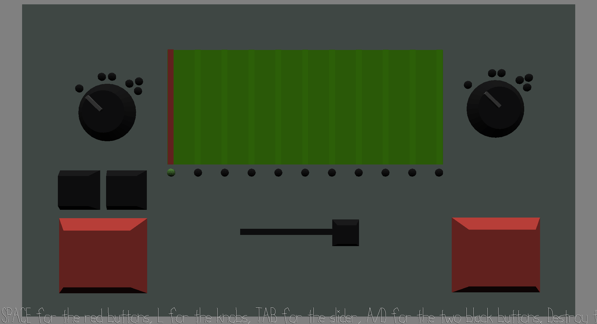

# Decimation of Dagon

Author: Joshua Mathews

Design: Uses sound and a tactile control panel to locate and destroy an enemy.

Screen Shot:

How To Play:

The only keys used are spacebar, tab, A, D, L. I would recommend trying to figure out what the buttons do, what the goal is and how to achieve it as that is part of the experience. However, it is also explained below.

Explanation

The right side controls the sonar device and the left the missile launcher. TAB switches control between them.

First you use the sonar device to find the location of the sea creature. Pressing space sends a sound which you will hear when it touches the creature (NOT when it comes back). The red line helps you keep track of the distance. Pressing L switches between the 3 axes letting you get it's 3D coordinates.

Then, you switch to the missile device, set the 3 coordinates using the A/D keys, L and the green light and then Space to launch the missile. The sound cue tells you whether you have won or not.

  

This game was built with [NEST](NEST.md).
